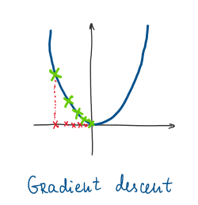
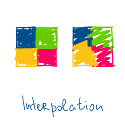
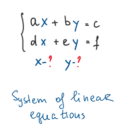
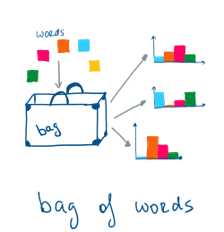
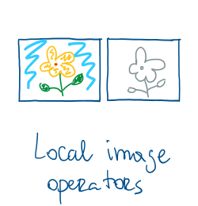
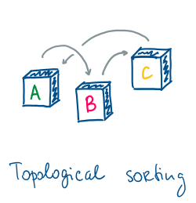
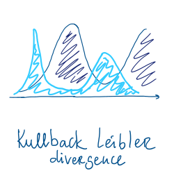
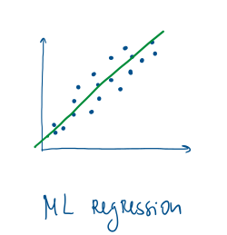

# Small projects to clarify big concepts

In this project, I try to clarify for myself and others the big mathematical (and not only) concepts.
I try to find the simplest possible example and roll from there by asking a lot of "simple/obvious/stupid" questions.
Here you can find a collection of Jupyter notebooks with different amount of content in them.

The links below will render the notebooks in [**nbviewer**](https://nbviewer.jupyter.org/).

## Main finished notebooks
|  |   | |
:-------------------------:|:-------------------------: | :-------------------------:
   |      |  
  |    |  
 |    |

[**gradient_descent**](https://nbviewer.jupyter.org/github/ovysotska/in_simple_english/blob/master/gradient_descent.ipynb) - simplistic visualization of 1D and 2D gradient descent.

[**bag_of_visual_words**](bag_of_visual_words.ipynb) - tf-idf reweighting for visual bag of words in pictures.

[**homogeneous_coords**](https://nbviewer.jupyter.org/github/ovysotska/in_simple_english/blob/master/homogeneous_coords.ipynb) - couple of geometric operation for homogeneous points.

[**Interpolation**](https://nbviewer.jupyter.org/github/ovysotska/in_simple_english/blob/master/Interpolation.ipynb) - mainly thoughts about cubic interpolation and how to apply interpolations for scaling up images.

[**system_of_linear_equations**](https://nbviewer.jupyter.org/github/ovysotska/in_simple_english/blob/master/system_of_linear_equations.ipynb) - overview of how to solve Ax=b and Ax=0

[**local_image_operators**](https://nbviewer.jupyter.org/github/ovysotska/in_simple_english/blob/master/local_image_operators.ipynb) - local image operators. Applying Binomial, Box and Sobel filter.

[**topological_sorting**](https://nbviewer.jupyter.org/github/ovysotska/in_simple_english/blob/master/topological_sorting.ipynb) - code snippet to practice graph search using topological sorting.

[**Kullback_Leibler**](https://nbviewer.jupyter.org/github/ovysotska/in_simple_english/blob/master/Kullback_Leibler.ipynb)  - an example of comparing two 1D discrete distribution using Kullback-Leibler divergence.

[**ml_regression**](https://nbviewer.jupyter.org/github/ovysotska/in_simple_english/blob/master/ml_regression.ipynb) - maximum likelihood estimation for linear regression. Bundle adjustment as a ML estimation method

## Folder `in_progress`
This folder contains more complicated topics which were not completely simplified yet.

## Gaussian Processes (gp)
	* **GP_starting example**  - implementing GP from scratch
	* **Gaussian_processes_functional** - GP implementation using funtional programming and multi dimensional input
	* **SkLearn_example** - model selection and first steps for optimal parameter selection using sklearn framework

